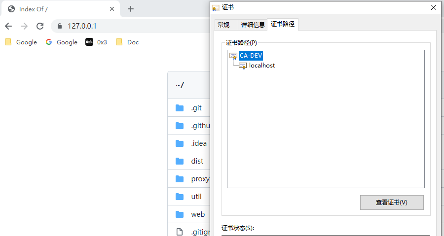

# DEV-SERVER

A simple dev server.

If https is enabled, You should trust the root CA. It is generated in ` ~/.dev-server/ca.cer`.



## Install

- download [releases](https://github.com/TMaize/dev-server/releases)

- Go

  ```shell
  go install github.com/TMaize/dev-server@latest
  ```

- Node.js

  ```shell
  npm install @tmaize/dev-server -g
  ```

## Feature

- [x] static server

- [x] https support

- [x] list dir

- [x] http reverse proxy, cors

- [ ] [trust Root CA](https://github.com/FiloSottile/mkcert/blob/master/truststore_windows.go)

- [ ] mock data

## Usage

static server

```
dev-server start
dev-server start -p 8443 --https --domain test.com /site/demo
```

http reverse proxy

```
dev-server proxy --target https://uptream.com:8443
```

## Acknowledgments

[spf13/cobra](https://github.com/spf13/cobra)

[https://github.com/kubernetes/client-go/blob/master/util/cert/cert.go](https://github.com/kubernetes/client-go/blob/master/util/cert/cert.go#L84)

[https://github.com/vitejs/vite/blob/main/packages/vite/src/node/certificate.ts](https://github.com/vitejs/vite/blob/main/packages/vite/src/node/certificate.ts)
